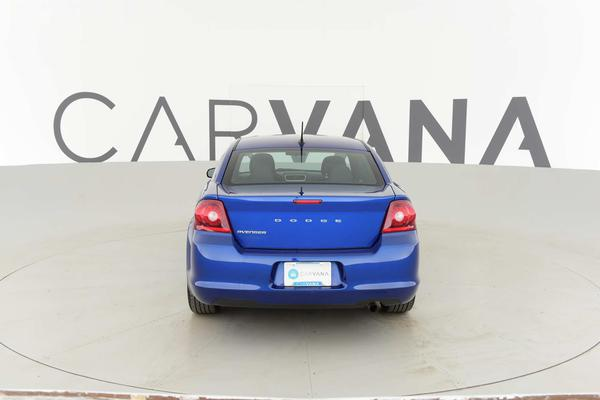

# CS 763 2018 Project - Style Transfer for Cars

## Overview
We will combine the content of one image of a car and style from another image(painting, texture etc) into a new image for which content is obtained from the first image on which the style from the second image is transferred.
We will first identify the body of cars(where the style is transferred) using segmentation on the car parts. In the image shown below from the dataset style should be applied only on the body not on the building nor the person/tyres/windshield etc.

Next we will follow on the lines(building up on this, will need to innovate to transfer style to specific pixels) of an efficient solution proposed by Leon A. Gatys trains feed-forward convolutional neural networks by defining and optimizing perceptual loss functions. We also intend to use cues like depth, neighborhood pixels, as well as planarity to transfer style better.
This idea enables us to create a simple application like “Prisma” for cars, in which we can change the body of the car as we wish.

## Approach
The initial image is segmented using K-means clustering in HSV color space and the obtained mask for the car body is extended/refines at the boundaries by having a threshold on the distance from the cluster center + the distance from the nearest boundary point (with distance in HSV space). This refined mask is sent to the style transfer optimization(we use the default method by Gatys et.al) and the style is transferred only to the body pixels obtained through the mask.

## Dependencies
	* Python
		* numpy	
		* PIL
		* sklearn
		* skimage
	* Torch
		* cutorch 
		* cunn
		* image
		* nn
## Running

`python3 segment.py <num_iterations> <input_image> <output_image>`
`python3 refine.py  <input_image> <input_mask> <neighborhood_width> <threshold>`
`th main.lua --style --content --size 0 --output_dir`

`python3 segment.py <num_iterations> <input_image> <output_image>` segments the input image using k means clustering in HSV space.
`python3 refine.py  <input_image> <input_mask> <neighborhood_width> <threshold>` refines the output mask by checking neighborhood of boundary points of mask and iteratively includes possible inclusions.
`th main.lua --style --content --size 0 --output_dir` performs style transfer on the content image. The options mentioned are the default ones.	


## Example 1

Running it for <100 iterations seems to produce nice results. With certain
images or output sizes, you might need some hyperparameter tuning (especially
`<neighborhood_width>`and `threshold`).


These were the input images used:


## Example 2


These were the input images used:


## Example 3


These were the input images used:


## Example 4


These were the input images used:




## Acknowledgement
```
 * Style Tranfer code: https://github.com/kaishengtai/neuralart
 * Segmentation : https://github.com/asselinpaul/ImageSeg-KMeans
 * Style transfer : 
 	Gatys, Leon A., Alexander S. Ecker, and Matthias Bethge. "Image style transfer using convolutional neural networks." Proceedings of the IEEE Conference on Computer Vision and Pattern Recognition. 2016.
